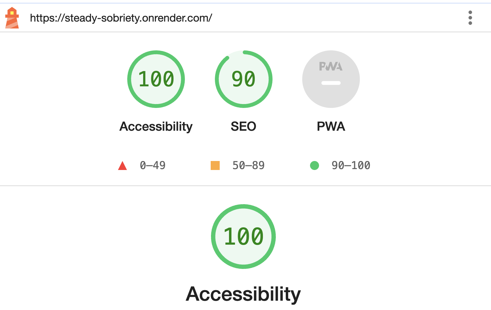

# SteadySobriety

**Authors:** [Yuqi Hu](https://yuqihu1103.github.io/) and [Zhiqian Zhang](https://zhiqian-zhang.github.io/ZhiqianZhang-Peronal-Website/)

**Class:** [CS5610 at Northeastern](https://johnguerra.co/classes/webDevelopment_fall_2023/)

**Deployment:** https://steady-sobriety.onrender.com/

**Project Objectives:**

SteadySobriety is a web application designed to provide essential tools and support for individuals seeking to overcome alcohol abuse
and maintain lasting sobriety. This platform offers a range of features that help users on their journey towards a healthier,
alcohol-free life. After registering and logging in, user can log the time of their last drink and view their drinking history. User can keep track of their sobriety streak and compare with other users on the scoreboard. We'll also add a discussion forum and improve on desgin, accessibility and usability in the future.

## Project Demo and Presentation

**Project Demo Video:** [3-min Demo](https://youtu.be/a0rUKtjYNrE)

**Project Presentation and Slides:** [2-min Presentation](https://youtu.be/7kqo9yISblk) | [Slides](https://docs.google.com/presentation/d/1bwjb_-aFty6QstsUDy_j1427GTJmW1Us-pnAwRehrSU/edit#slide=id.g297f0f13694_0_108)

**Overview(gif)**


## Instructions to Build

### Installation

Clone this repository

```
https://github.com/yuqihu1103/SteadySobriety.git
```

Change your current working directory to the project directory.

All the following commands assumes you are in the project root directory.

```
cd path/to/the/repo/SteadySobriety
```

Run the following command to install dependencies for both frontend and backend and build the frontend.

Same as running `npm install && cd front && npm install && npm run build`.

```
npm run build
```

Start the backend server, which will be running on http://localhost:3000.

```
npm start
```

### Database

To use this application locally, you need to have a Mongo server running on localhost:27017, or configured in the MONGOMONGODB_URI environment variable.

Run the following command to initializing the database. It will create a SteadySobriety databases with collections users and sober_logs, each populated with 1000 synthetic records.

Note that this will overwrite existing data, if there is any.

```
npm run initDB
```

You can also run our script to generate new mock data before initializing database

```
node db/mock_data/mock_data.js
```

## Project Design

Design documents can be found in the [docs](docs) folder, including:

1. [Project Description](docs/project_description.txt)
2. [User Personas and User Stories](docs/user_personas_and_stories.txt)
3. [Design Mockup](docs/design_mockup.pdf) overview:


## More Design, Accessibility and Usability

Learn more about the designm accessibility, and usability of the Steady Sobriety application.

### Usability Study

1. [Consent Form](docs/usability_study/usability_study_informed_consent_document.pdf)
2. Usability Study Question
3. Usability Study Report

### User Interface Design

1. Layout/Hierarchy
2. Typography
3. Color

### Accessibility

1. Demonstration of using the application with only keyboard
2. Accessibility test result with axe or lighthouse
   

## Technologies

**Backend**: Node + Express, MongoDB, passport.js

**Frontend**: React, Vite, CSS, Bootstrap

**Deployment**: Render, MongoDB Altas

## License

This project is licensed under the MIT License - see the [LICENSE](LICENSE) for details.
